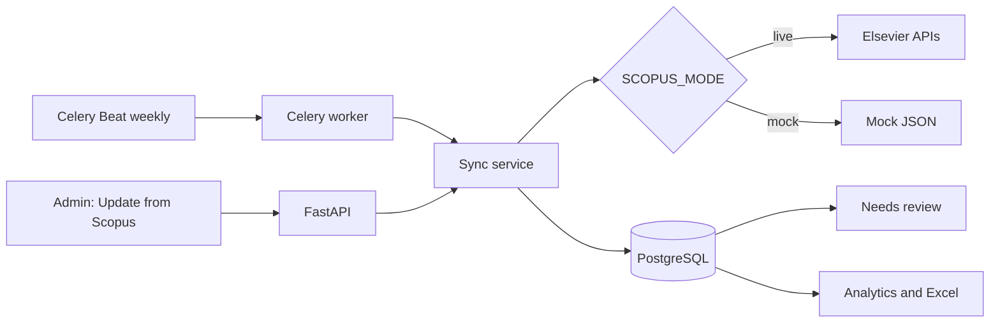

# Architecture and processing rules

## Synchronization flow

The confirmed Scopus Author ID is immutable during sync. Search candidates are never silently selected. Multiple confirmed IDs are represented by `professor_scopus_ids`; one is primary.

For each EID, the service upserts publication metadata and attaches it to the professor. Affiliations resolve in this order: Scopus ID, verified alias, structured country, deterministic country name/ISO match, then review. Raw JSON/text is always preserved. One collaboration is allowed per publication, professor, and foreign institution. German and UTN institutions are never inserted into that table.

## Security boundaries

The browser talks only to FastAPI through the Next.js `/api` rewrite. The Elsevier key exists only in backend/worker environments. Passwords use bcrypt; JWTs are signed, time-limited and stored in HttpOnly SameSite cookies. Role checks are backend dependencies, not UI-only controls. CSV extension and size are validated, workbook cells are escaped against formula injection, and administrative changes create audit entries.

## Extension points

- Implement UTN OIDC/SAML behind the existing user/role contract.
- Add an institution-registry adapter between deterministic resolution and human review.
- Add object storage and signed links for approved exports.
- Add an optional disabled-by-default AI suggestion provider that can propose but never auto-verify mappings.
