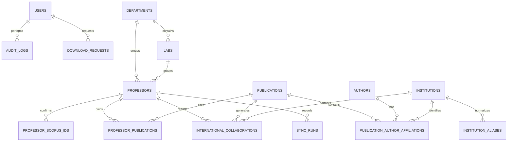

# Entity relationship diagram

Primary duplicate defenses are unique Scopus EID, unique professor/publication links, unique normalized institution aliases, and unique `(publication_id, professor_id, institution_id)` collaborations.
